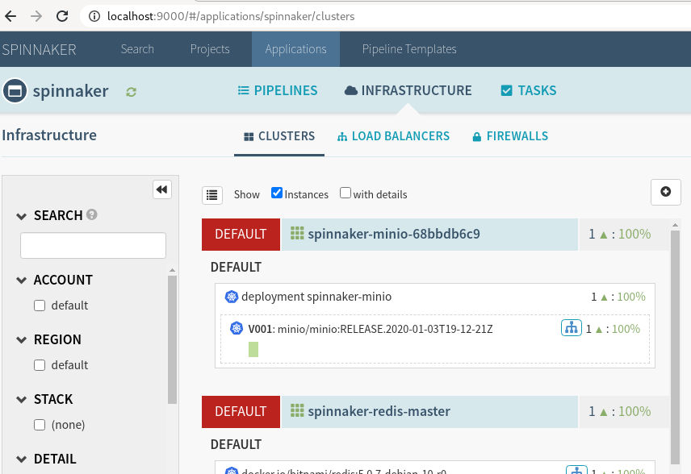

# dice
As part of a lab on kubernetes, this repo demonstrates a basic setup consisting of:
* a 2+1 node Kubernetes cluster running on AWS, deployed with kops,
* a Spinnaker release,
* an Istio setup,
* and a canary deployment of a simple demo application

## Prerequisites

### Docker
The installation instructions assume that you have a working installation of Docker. If you want to run without Docker, you will have to make sure to use compatible versions of any required third-party tools, including:

* kubectl
* kops
* helm
* jq
* halyard
* istioctl

Verify your Docker installation:

	$ docker run alpine /bin/echo 'Good to go!'
	Good to go!

### AWS
You will also need an AWS account with a user who can create and manage policies, roles and other users. IAMFullAccess should be sufficient, but more restrictive policies may work as well.

We need to configure a profile named `dice` for this user in AWS CLI:

	$ aws configure --profile dice
	# enter your credentials and region, then verify like this:

	$ aws --profile dice sts get-caller-identity
	{
		"UserId": "AIDA...",
		"Account": "...",
		"Arn": "arn:aws:iam::...:user/..."
	}

Your account should have a Hosted Zone in Route 53 for the domain in which you want to host the k8s cluster. E.g. if your cluster is to be called `dice.example.com`, you should have a Route 53 Hosted Zone for `example.com`. Verify your DNS setup:

	$ aws route53 list-hosted-zones | jq '.HostedZones[] | select(.Name == "example.com.") | .Id'  # note the extra dot at the end of the domain name
	"/hostedzone/..."

	$ dig +short NS example.com
	ns-1.awsdns-1.org.
	ns-2.awsdns-2.net.
	ns-3.awsdns-3.com.
	ns-4.awsdns-4.co.uk.

### SSH Keypair
`kops` needs to use an SSH keypair to manage the EC2 instances of the kubernetes cluster. You can either configure dice to use an existing RSA keypair in [config.env](config.env), or create a new one like this:

	$ ssh-keygen -t rsa -b 4096 -f ~/.ssh/id_kops

## Installation

### Toolbox docker image
Adjust the values in [config.env](config.env) to your environment and run 

	$ make toolbox

to build the `dice-toolbox` image from the provided [Dockerfile](infra/Dockerfile). This contains all required tools for the rest of the deployment.

Note: Building the toolbox explicitly is technically optional, as it will be pulled in automatically by the following make targets.

### Provision IAM user and state bucket

Next, run

	$ make kops-admin

to prepare an IAM user and a state bucket for `kops`. This step uses [Terraform](https://www.terraform.io/) for reproducible provisioning: [create-kops-user.sh](infra/aws/create-kops-user.sh) is executed inside a dice-toolbox container to deploy the terraform scripts in [kops-iam](infra/aws/kops-iam).

Note that the generated credentials are shown on the terminal and stored in the terraform state file (we need those later). In a production setup you would want to hide them and store them in a safe place instead, e.g. in an S3 object with appropriate permissions.

`create-kops-user.sh` then uses these generated credentials from `terraform output` to create and configure an S3 bucket for hosting the kops state.

### Kubernetes cluster

While [kops](https://https://kops.sigs.k8s.io/) is a popular and convenient cluster management tool, it does not play too nicely in a pure infrastructure-as-code environment. A major concern in such a setup is that kops uses an action-based CLI model. This contrasts with the more state-description model that is typical for many IaC tools (Terraform, Ansible, CloudFormation, etc). For simplicity, we will resort to a set of simple shell scripts, which are run within a toolbox container to orchestrate kops. Given enough time, fancier options would include
* a custom Terraform provider,
* improved state detection and error handling in the provided shell scripts, or
* cloud-based installation, e.g. using CloudFormation or the Code* family of AWS services.

tl/dr; Create the kubernetes cluster by running

	$ make k8s-cluster

and be aware that this is not strictly idempotent.

This runs [create-cluster.sh](infra/k8s/create-cluster.sh) inside a dice-toolbox, which uses kops to configure, deploy and validate the cluster, and which sets up an initial RBAC policy for helm.

Note: The cluster may take a few minutes to become healthy. By default, the validation call will allow for up to 15 minutes until it times out.

### Spinnaker

We deploy [Spinnaker](https://spinnaker.io) with Terraform's [Helm provider](https://registry.terraform.io/providers/hashicorp/helm/latest/docs) using the scripts in [infra/k8s/spinnaker](infra/k8s/spinnaker/):

	$ make spinnaker

An easy way to see Spinnaker in action is via the `spin-deck` UI:

	$ kubectl port-forward service/spin-deck 9000:9000 &
	$ kubectl port-forward service/spin-gate 8084:8084 &
	$ xdg-open http://localhost:9000/

	
### Istio

Like Spinnaker, [Istio](https://istio.io/) is deployed with Terraform and Helm, this time using configuration from [infra/k8s/istio](infra/k8s/istio/):

	$ make istio

Deploying Istio with helm can be a bit problematic in the sense that it consists of two charts (`istio-init` and `istio`) which have to be released in order. Unfortunately, even when we wait for `istio-init` to finish before deploying the `istio` chart, the process may fail with what appears to be a CRD race condition. For now, the easiest workaround is to retry terraform when that happens. A slightly less ugly alternative would be to use targetting in terraform (or lifecycle dependencies) followed by some `kubectl` magic to better separate the chart deployments. In a production setup, you would want to dig depper into what causes the issue and search for a proper solution.

After validation, the installation script [install-istio.sh](infra/k8s/install-istio.sh) uses `istioctl` and `kubectl` to activate the target profile and label the `default` namespace for [Envoy](envoyproxy.io) sidecar injection.

We also install kiali, so the dashboard can be access by running

	$ istioctl dashboard kiali

### Optional: Deploy Kubernetes Dashboard

The Kubernetes dashboard can be deployed by running

	$ make dashboard

This uses `kubectl` directly to install Dashboard from upstream and to configure RBAC. Afterwards, [install-dashboard.sh](infra/k8s/install-dashboard.sh) generates an access token in JWT format, as well as proxy instructions and a link to the UI.

## Deploy an app

### Push a simple web app

Dice ships with a demo application in the [app/](app/) directory.

To deploy the application, we should build an image and push it to some accessible repository, such as ECR. Given an ECR repository in your account, use this command to push your image:

	$ make build-webapp

This creates two versions of a simple web app:
* `dice-app:stable` responds to "GET /" with a JSON document containing random number between 1 and 6
* `dice-app:testing` does the same for numbers between 10 and 20.

### Deploy the app

Once the image is stored in the repository, we can deploy the demo app with the provided yaml file [dice-app.yaml](app/dice-app.yaml):

	$ make deploy-webapp

This creates a deployment and a service object in the default namespace.

To check that everything went fine, we can interact with dice-app via curl:

	$ make verify-webapp
	1
	10
	2

